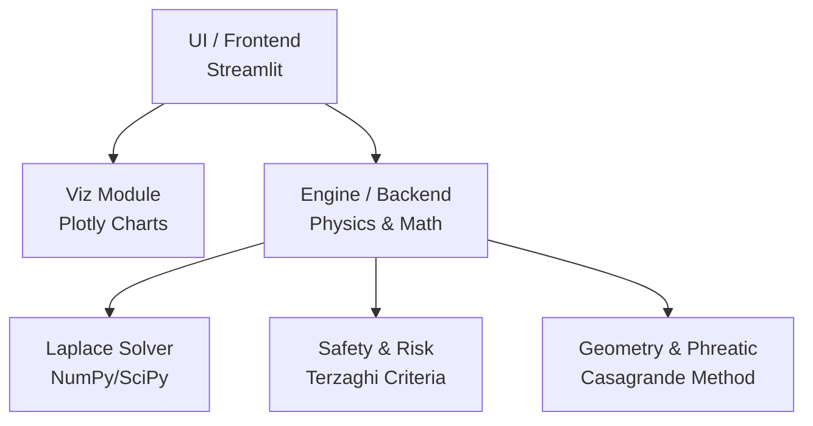

# Project Report: 2D Steady-State Seepage Flow Simulator in Earth Dams

## 1. Introduction
The **Seepage Flow Simulator** is a computational tool designed to model and analyze the steady-state flow of water through an earth dam. In geotechnical engineering, understanding seepage is critical for ensuring the structural integrity and stability of dams. Excessive seepage can lead to internal erosion, piping, and ultimately, catastrophic failure. This project combines fundamental geomechanics principles with modern computational methods to provide a real-time, interactive simulation of hydraulic head, flow nets, and safety factors.

---

## 2. Geomechanics Fundamentals

### 2.1. Darcy's Law
The foundation of seepage analysis in soils is **Darcy’s Law**, which states that the flow rate of water through a porous medium is directly proportional to the hydraulic gradient.
* **Equation:** `q = k · i · A`
  * `q` = discharge (volume of water per unit time)
  * `k` = hydraulic conductivity (permeability) of the soil
  * `i` = hydraulic gradient (`Δh / L`)
  * `A` = cross-sectional area of flow

In this simulator, the hydraulic conductivity (`k`) is a user-defined parameter that drastically alters the velocity and volume of the seepage discharge.

### 2.2. Laplace's Equation for 2D Seepage
For steady-state seepage in a homogeneous, isotropic soil where water and soil are considered incompressible, combining Darcy's Law with the principle of conservation of mass yields the **Laplace Equation**:
* **Equation:** `∂²h/∂x² + ∂²h/∂y² = 0`

Here, `h` represents the total hydraulic head. Solving this partial differential equation over the dam's geometry allows us to map out the entire head distribution within the earth structure.

### 2.3. The Phreatic Line (Casagrande's Method)
The topmost boundary of the seepage zone within the dam is called the **phreatic line** (or line of seepage). Along this line, the water pressure is exactly atmospheric (pore water pressure = 0). Finding this line is complex because it is an unknown boundary condition.
* The simulator approximates the phreatic line using **Casagrande's geometric method**, calculating the parabolic curve that connects the upstream water level to the downstream face. 
* The area below this line is considered saturated (governed by Laplace's equation), while the area above is considered dry.

### 2.4. Exit Gradient and Piping Risk
One of the primary causes of earth dam failure is **piping** (internal erosion). This occurs when the upward seepage force at the downstream toe of the dam exceeds the downward effective weight of the soil.
* **Exit Gradient (i_e):** The hydraulic gradient where the water exits the soil surface.
* **Critical Gradient (i_c):** Typically around 1.0 (depending on soil specific gravity and void ratio). If `i_e > i_c`, soil particles will be washed away.
* **Factor of Safety (FS):** Calculated as `FS_piping = i_c / i_e`. A minimum FS of 3.0 to 4.0 is usually required in dam design.

---

## 3. Computational Implementation & Coding

### 3.1. The Finite Difference Method (FDM)
To solve the Laplace equation across the complex geometry of the dam, the project employs the **Finite Difference Method**.
1. **Grid Generation:** The dam cross-section is discretized into a 2D grid (`Nx` columns by `Ny` rows).
2. **Boundary Conditions:** 
   * Upstream face: Head = `H_u` (Constant)
   * Downstream face/toe: Head = `H_d` (Constant)
   * Impervious base: No-flow boundary (`∂h/∂y = 0`)
   * Phreatic line: Head = Elevation (`h = y`)
3. **Iterative Solver:** The simulator uses an iterative relaxation technique. Each node's head is repeatedly updated to be the average of its four neighboring nodes until the maximum change between iterations falls below a small tolerance limit.

### 3.2. Software Architecture
The codebase is structured following modern software engineering principles, dividing the logic into distinct modules:

### 3.3. Technologies Used
* **Python**: The core language used for all calculations and logic.
* **NumPy**: Utilized for high-performance array operations and matrix computations required by the Finite Difference grid.
* **Plotly**: Powers the interactive visualization. It renders the flow net (equipotential lines and streamlines) and the particle animation, allowing the user to zoom and hover for exact data points.
* **Streamlit**: The framework used to build the interactive web application, allowing users to tweak hydraulic parameters via sliders and instantly see the updated physics simulation without requiring web development experience (HTML/JS).

---

## 4. Visualizations & Image Placeholders

*(Note: Replace the placeholders below with actual screenshots from your running Streamlit application)*

### 4.1. The Flow Net
The flow net is a visual representation of the Laplace equation solution, showing intersecting **equipotential lines** (lines of constant head) and **streamlines** (paths of water particles).

> 
> *Figure 1: Computed flow net showing the phreatic line, equipotential lines, and streamlines.*

### 4.2. Velocity Field
By taking the derivative of the hydraulic head across the grid (`v = -k * i`), we obtain the velocity field.

> 
> *Figure 2: Seepage velocity magnitude distribution. Notice the higher velocities near the downstream toe.*

### 4.3. Safety Dashboard
The dashboard calculates the Factor of Safety in real-time, alerting the engineer if the parameters input result in a critical risk of piping or heave.

> *Figure 3: Interactive safety gauges and risk assessment based on the computed exit gradient. (Screenshot pending)*

---

## 5. Conclusion
This project successfully bridges classical soil mechanics with modern computational data science. By discretizing the dam geometry and numerically solving the governing differential equations, the tool provides immediate visual and analytical feedback. This allows for rapid iteration and sensitivity analysis—critical components in the safe design and evaluation of earth retaining structures.
